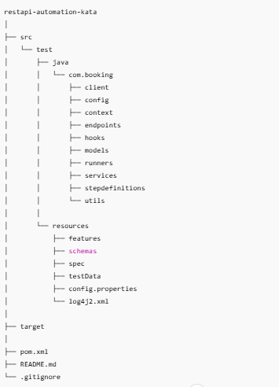

# Kata API Testing in Java
## Original Specification

API Testing and Java Exercise: Setting up a Basic API Test Automation Framework.

## Objective
The objective of this exercise is to evaluate your knowledge on API testing and Java by setting up a basic API Test Automation framework using Rest-Assured and Cucumber. You will need to create a test suite that executes a few tests against one endpoint of a hotel booking website and evaluates their responses.

## Background
The application under test is a simple hotel booking website where you can book a room and also send a form with a request.

The website can be accessed at https://automationintesting.online/.

The Swagger documentation for the two endpoints you will be testing can be found at:

Booking endpoint: https://automationintesting.online/booking/swagger-ui/index.html  
Optionally, you also have the Authentican endpoint: https://automationintesting.online/auth/swagger-ui/index.html

### Swagger
This website is an external application which is not in our control.  
We noticed that the Swagger documentation is sometimes not available on the mentioned URL above.  
As a backup, you can find the Swagger documentation in this repository at [src/test/resources/spec/booking.yaml](src/test/resources/spec/booking.yaml)

The Open API Spec file is only supported in the Ultimate version of IntelliJ IDEA. But you can copy the content of the file and paste it in an online Swagger editor like https://editor.swagger.io/ to visualize the API documentation.

### Authentication
In order to authenticate yourself, the required credentials are:
* Username: `admin`
* Password: `password`

## Task
You are provided with an extremely basic API test project.

Please clone the project and create a new branch with your name. At the end, please push your branch to this project.

The project to start from, can be found here: https://github.com/freddyschoeters/API_Testing_kata

Your task is to set up an API Test Automation framework from this project using Java, Rest-Assured, and Cucumber (feel free to add more dependencies if required).

It is up to you to define the test cases. You don’t need to have a full coverage, but you need to show enough variation on the types of tests that you would need to write and execute, and what to check in the response.

This kata has the purpose to evaluate both your technical skills as well as your testing skills.

`For this task, you will use the booking endpoint.`

## Requirements
* Use Java as the programming language
* Use Rest-Assured as the API testing library
* Use Cucumber as the BDD framework
* Design your codebase using a proper Java design pattern
* Write good tests with correct checks
* Use Git for version control and push your codebase to an open GitHub repository
* Make regular commits to demonstrate your progress

## Deliverables
* Your branch pushed in the provided project.
* A comprehensive test suite covering the scenarios mentioned above
* A well-structured codebase with proper design patterns and comments
* Regular commits demonstrating your progress

## Evaluation Criteria
* Being able to successfully run the tests
* Correctness and completeness of the test suite
* Quality of the codebase (design patterns, structure, code quality, …)
* Use of Rest-Assured and Cucumber features
* Commit history and progress demonstration
------------------------------------------------------------------------------------------------
**Automation Objectives**
------------------------------------------------------------------------------------------------
**1. Overview**

This repository contains a scalable, maintainable API automation framework built to validate a RESTful Booking API.
The framework is designed using real-world enterprise practices, focusing on readability, modularity, and extensibility.

It demonstrates how API automation is implemented in professional QA teams, beyond simple RestAssured scripts.

------------------------------------------------------------------------------------------------
**2. Tech Stack** 

* Java 17
* Rest Assured – API testing
* Cucumber (BDD) – Business-readable scenarios
* JUnit – Assertions
* Log4j2 – Logging
* Apache POI – Excel-based test data
* Maven – Build & dependency management
------------------------------------------------------------------------------------------------
**3. Framework Architecture**

------------------------------------------------------------------------------------------------
**4. Design Principles**

* BDD-first approach (business readable scenarios)
* Service abstraction (no RestAssured in step definitions)
* Single Responsibility for utilities
* Low cyclomatic complexity (≤ 5 per method)
* Data-driven testing via Excel datasets

------------------------------------------------------------------------------------------------
**5. Test Coverage**
The framework currently validates:

- ✅ LOGIN AUTH (POST)
- ✅ Booking creation (POST)
- ✅ Positive and negative scenarios
- ✅ Schema validation
- ✅ Field-level response validation
- ✅ End-to-end booking lifecycle
------------------------------------------------------------------------------------------------
**6. Test Data Strategy**
- Test data is externalized using Excel, simulating legacy enterprise environments where data is often maintained 
by non-technical stakeholders.

- Each test scenario refers to a dataset key, keeping scenarios clean and reusable.

- Example:
- When a guest creates a booking with "ROOMID_VALID"

------------------------------------------------------------------------------------------------
**7. How to Run Tests**
- **Prerequisites**
- Java 17+
- Maven 3.8+

------------------------------------------------------------------------------------------------
**8. Run all tests**
- mvn clean test

------------------------------------------------------------------------------------------------
**9. Run a specific feature**
- mvn test -Dcucumber.filter.tags="@booking"

------------------------------------------------------------------------------------------------
**10. Logging**
- Centralized logging using Log4j2
- Logs are written to console and rolling log files
- Log files are excluded from version control (.gitignore)

------------------------------------------------------------------------------------------------
**11. Why This Framework?**

- This project is built to reflect how API automation is done in real teams, not just demo scripts:
- Clean separation of concerns
- Maintainable structure
- Interview-ready design
- Easy to extend with new APIs or scenarios

------------------------------------------------------------------------------------------------
**12. Open Bugs**
------------------------------------------------------------------------------------------------
**12. 👤 Author**
- Saravanan Subramaniyan
- Senior QA | API Automation | Framework Design